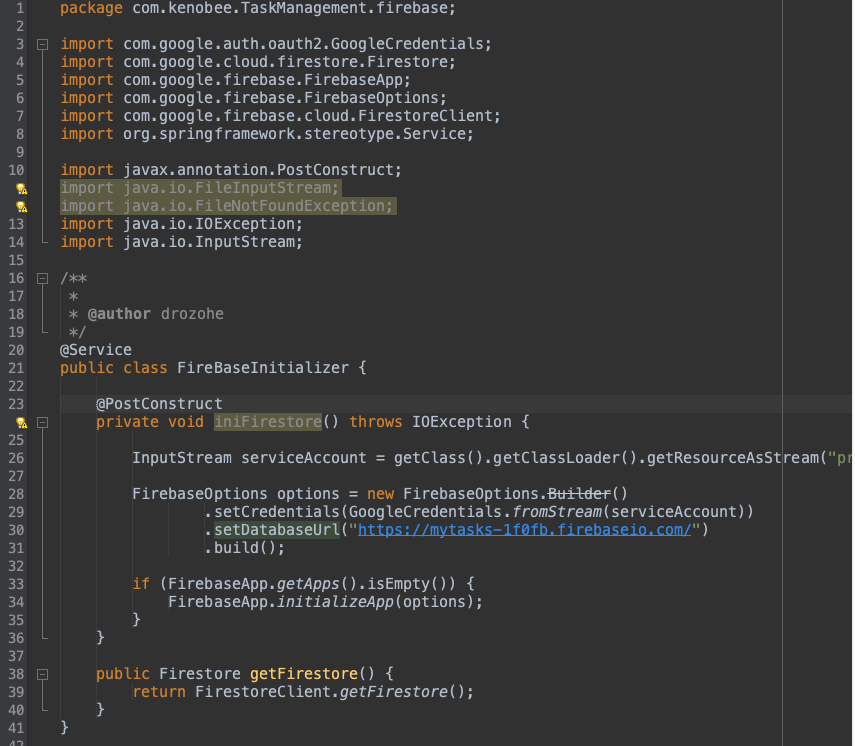

### CRUD con Spring Boot y Cloud Firestore
Creación de un servicio web **RESTful** con un CRUD básico completo, con un modelo de autenticación **OAUTH2**, bajo el framework de **Spring Boot.**

## Modelo de datos

# Creación del proyecto en Cloud Firestore
Agregar un nuevo proyecto en la plataforma de Firebase, indicando nombre del proyecto, aceptando las opciones por defecto y seleccioando la cuenta por defecto de **Google Analytics**
Al terminar estos pasos estará listo el proyecto en Cloud Firestore

Luego procedo a crear la clave privada de la aplicacion, guardandola un un archivo .json dentro del proyecto, en el direcotorio de recursos del mismo.

Por último, de acuerdo con la documentación de Firebase, incluyo las sentencias correspondientes para cargar la clave privada de la aplicación, incluyendo ademas
la ruta de la base de datos (ver imagen)

# Proyecto en Spring boot

1. Inicializo el proyecto con el asistente inicializador

2. Agrego las dependencias iniciales como lombok, web y dev tools

3. Creo el paquete controller y ahí genero la clase TaskController.java que será la encargada de orquestar los endpoints configurados.

   

   En este controlador se inyecta el servicio y a través de la interface se accede a la implementacion de los microservicios

4. Dentro del paquete firebase, creo la clase que incicilizará la base de datos en cloud firestore de acuerdo con la documentación del SDK. Tambien agrego la url de la base de datos
   y las dependencias correspondientes en el archivo pom.xml

   La clave privada de la base NOSQL se coloca en el archivo .json que está en el directorio resources.

   

5. Creación de la interface TaskManagementService.java

   En esta se relacionan los servicios sin implementarlos
   

6. Creacion de la clase que implementa la interface anterior. Aquí estan implementados la logica de los microservicios (CRUD).
   Tambien se encuentran los métodos para recuperar los documentos de las colecciones, listarlos, editarlos y eliminarlos.

   

7. Cada uno de los microservicios tiene su correspondiente en el controlador (TaskController.java) que es desde donde son llamados.
8. Creo el archivo SecurityConfig.java dentro del paquete security. Contiene la configuracion de para la autorizacion de acceso a los endpoints.
   Esta autorizacion se realizó con google console, siguiendo las indicaciones de esta documentación
   [Links](https://docs.askdata.com/docs/dataset-google-analytics-how-to-get-google-client-id-and-client-secret)

    En el archivo application.properties se anexaron las llaves privadas client-id y client-secret.

### Ejecucion del CRUD

El puerto asignado es el 5264

## Listado de servicios

Create: http://localhost:5264/tasks/v1/add
Read:   http://localhost:5264/tasks/v1/list
Update: http://localhost:5264/tasks/v1/{id}/update
Delete: http://localhost:5264/tasks/v1/{id}/delete

Al ejecutar cualquier endpoint, solicitará autenticación con la cuenta de google

Este es el resultado del microservicio listar

